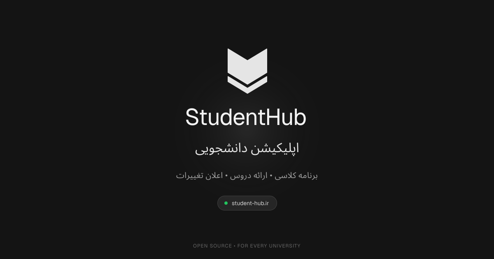

<p align="center">
  <a href="https://student-hub.ir">
    
  </a>
</p>

<h1 align="center">StudentHub</h1>

<p align="center">
  The open-source student hub for Iranian universities — Telegram Mini App + web. Curriculum charts, live course offerings, change alerts. Data is community-owned JSON, contributed by PRs.
</p>

<p align="center">
  <a href="https://github.com/taymakz/studenthub"></a>
  <a href="https://x.com/taymakz"></a>
  <a href="https://student-hub.ir"></a>
</p>

<p align="center">
  <a href="https://student-hub.ir">Website</a>
  ·
  <a href="https://t.me/student_hub_bot">Telegram Bot</a>
  ·
  <a href="https://chart.student-hub.ir/">Chart Builder</a>
  ·
  <a href="https://github.com/taymakz/studenthub/releases">Releases</a>
  ·
  <a href="./CONTRIBUTING.md">Contributing</a>
</p>

<p align="center">
  <a href="https://student-hub.ir"></a>
</p>

## What is StudentHub?

StudentHub is an open-source platform for university students: browse your curriculum chart, see the actual course offerings for the current term (ساعت کلاس، امتحان، ظرفیت، استاد), get diff notifications when an offering changes, vote on professors, and download chart PDFs.

It ships as a **Telegram Mini App** (with a browser web fallback via the Telegram Login Widget) and is built as a **Turborepo monorepo**:

- **API** — Hono on Bun, deployed to Vercel serverless. Telegram `initData` HMAC auth (stateless) + OIDC/widget JWT for web.
- **Postgres is the only infrastructure** — no Redis, no MinIO, no queue. Users are Telegram chat ids.
- **The registry is the database** — universities, majors, degrees, curriculum charts, semester offerings, professors, archives and groups are all **JSON files in `packages/registry`**, contributed through PRs and validated by CI. DB rows only store registry slugs.
- **Diff-based notifications** — each new offerings snapshot is diffed against the previous one using the offering `index` (شماره) as the stable key; admins review and send manually, never auto-sent.

## Add your university

Registry-only PRs are the main way to contribute — no coding required, just JSON:

1. **Fork** the repo.
2. **Install the StudentHub Course Extractor** Chrome extension from the [Releases](https://github.com/taymakz/studenthub/releases) page, open your university's آموزشیار panel, and extract the course offerings.
3. **Paste** the extracted JSON at [chart.student-hub.ir](https://chart.student-hub.ir/) (file upload or `Ctrl + V`), then build your curriculum chart — terms, prerequisites and requirements. Use the existing [Azad Malard Computer Engineering](./packages/registry/registry/universities/azad-malard/majors/computer-engineering) chart JSON files as a reference.
4. **Export** from the Chart Builder and pick whether the chart is complete (`isCompleted`) and whether it covers both Mehr and Bahman entrants (`both.json`) or a single semester.
5. **Place the files** in the registry: the chart under `charts/<degree>/<yearDir>/` and the extracted offerings under `courses/<year>/<semester>/new.json`, then run `pnpm reg:build` at the repo root to validate and rebuild the index.
6. **Open a PR** — CI validates everything. Registry PRs must only touch `packages/registry/registry/`.

The full step-by-step guide (schemas, slug rules, file placement, examples) is in [CONTRIBUTING.md](./CONTRIBUTING.md).

## Run locally

```bash
docker compose up -d        # Postgres 17 (port 5433) — the only infra
pnpm install
cp apps/api/.env.example apps/api/.env
pnpm db:generate
pnpm db:migrate
pnpm dev
```

| App                | URL                                          |
| ------------------ | -------------------------------------------- |
| Mini App (Next 16) | `http://mini-app.student-hub.localhost:3000` |
| API (Hono on Bun)  | `http://api.student-hub.localhost:8000`      |
| Chart Builder      | `http://localhost:3001`                      |
| Admin              | `http://localhost:3002`                      |

For authenticated API calls in dev, generate signed initData:

```bash
pnpm --filter @workspace/db dev:initdata <chatId>
```

## Checks

Run these before pushing — CI runs the registry validation on every PR:

```bash
pnpm reg:build     # required after ANY edit under packages/registry/registry/
pnpm typecheck
pnpm lint
pnpm test
pnpm build
```

## Project structure

| Path                 | What it is                                                                                                      |
| -------------------- | --------------------------------------------------------------------------------------------------------------- |
| `apps/mini-app`      | Telegram Mini App + web (Next.js 16) — bootstrap gating, profile, offerings, professor votes, chart files.       |
| `apps/api`           | Hono on Bun (`/app/*`, `/me/*`, `/admin/*`, `/auth/*`) — maintenance gate, notifications, uploads via Telegram.   |
| `apps/chart-builder` | Chart editor (port 3001) — imports extension output, validates against `chartDocSchema`, exports registry JSON.   |
| `apps/extension`     | WXT MV3 Chrome extension — scrapes آموزشیار offerings, exports `courses/<year>/<semester>/new.json`.              |
| `apps/admin`         | Admin dashboard (Next.js) — users, notifications, uploads, feedback, settings.                                    |
| `packages/registry`  | **The community database** — all university/major/chart/offering JSON + Zod schemas + validator + index builder.  |
| `packages/db`        | Drizzle schema + migrations + seed scripts (Postgres).                                                            |
| `packages/ui`        | Shared RTL-first UI kit used by all apps.                                                                         |

## Contributing

PRs are welcome — both registry (data) and code. See [CONTRIBUTING.md](./CONTRIBUTING.md) for the full guide: local setup, adding a new university end-to-end, the registry JSON schemas with real examples, slug conventions, and the PR checklist.

## Commit Convention

All commits **must** follow Conventional Commits:

```
<type>(<scope>): <short description>
```

Allowed `type`: `feat`, `fix`, `chore`, `docs`, `refactor`, `perf`, `test`, `style`, `build`, `ci`, `revert`.

- Scope is optional but recommended, e.g. `feat(api): ...`, `fix(mini-app): ...`. Use `*` only for cross-cutting changes: `feat(*): ...`.
- Keep `type` and `scope` lowercase, use imperative mood, no trailing period, max ~72 chars.
- Breaking changes via `feat!:` / `fix!:` or `BREAKING CHANGE:` footer.

Examples:
- `feat: add validation for university and major consistency`
- `fix(telegram): handle expired file links gracefully`
- `chore(deps): bump next to 15.2.3`
- `feat(mini-app): add course conflict drawer`
- `feat(*): migrate shared utils to new structure`

Validated against `^(feat|fix|chore|docs|refactor|perf|test|style|build|ci|revert)(\(.+\))?: .+` — non-conforming commits will be rejected in review. See [AGENTS.md](./AGENTS.md) and [CONTRIBUTING.md](./CONTRIBUTING.md) for full rules.

## Star history

<a href="https://star-history.dera.page/#taymakz/studenthub&Date">
  <picture>
    <source media="(prefers-color-scheme: dark)" srcset="https://star-history.dera.page/svg?repos=taymakz/studenthub&type=Date&theme=dark" />
    <source media="(prefers-color-scheme: light)" srcset="https://star-history.dera.page/svg?repos=taymakz/studenthub&type=Date" />
    
  </picture>
</a>

